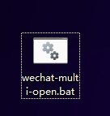
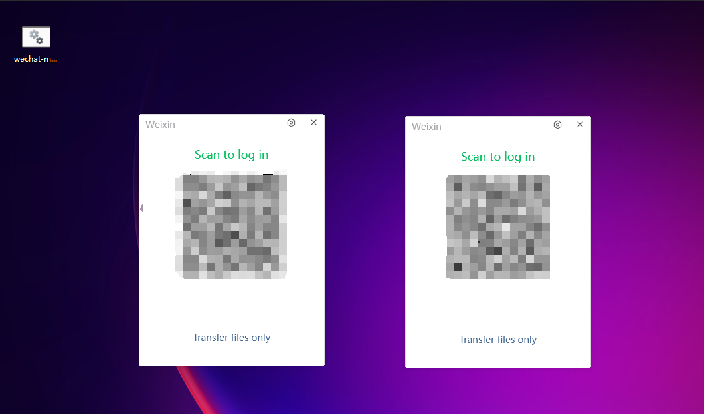

# Multi-Open-Scripts 🖥️
win系统软件原生多开方案，根据此方案可在win系统下将同一个软件开多个窗口


## 介绍及免责声明

### 介绍 📖
```
- 本工具适用于win系统，可用于多开同一个软件，包括但不限于微信、QQ、钉钉、企业微信、navicat、影刀、WPS、剪映、XMind、百度网盘等（均没有测试过，这段话是为了SEO）
- 该文档使用`微信`举例，是因为`微信`是一个国民软件，且微信的多开是一个非常常见的需求，写文档也有流量优势
```
### 免责声明 📜
```
- 本方案仅供学习和技术研究使用，不得用于任何商业或非法行为，否则后果自负
- 本文作者不对任何因使用本方案造成的损失负责，包括但不限于软件损坏、数据丢失、账号被封禁等
- 使用本方案即代表您已经知晓并同意以上免责声明，并自愿承担使用本方案的所有已知和未知风险
```


## 操作步骤 🛠️

### 0. 找到软件安装路径，并退掉该软件的所有后台 🔍
- 找到安装路径
    - 右键软件图标，选择：`打开文件所在位置`
    - 本例中，微信安装路径为：`D:\Program Files (x86)\Tencent\WeChat\WeChat.exe`
- 退掉该软件所有后台
  <br>
  

### 1. 新建txt文件，并将后缀改为.bat 📄
- 建议在桌面新建
- 在桌面新建一个 `wechat-multi-open.txt` 文件
- 并将文件名改为 `wechat-multi-open.bat`
  <br>
  

### 2. 将以下内容填充到bat文件中 ✏️
- 右键bat文件，选择 `在记事本中编辑` 打开，
- 将以下内容填充到bat文件中
```bat
@echo off

start "" "D:\Program Files (x86)\Tencent\WeChat\WeChat.exe"

start "" "D:\Program Files (x86)\Tencent\WeChat\WeChat.exe"

exit
```

### 3. 保存并双击运行 🚀

